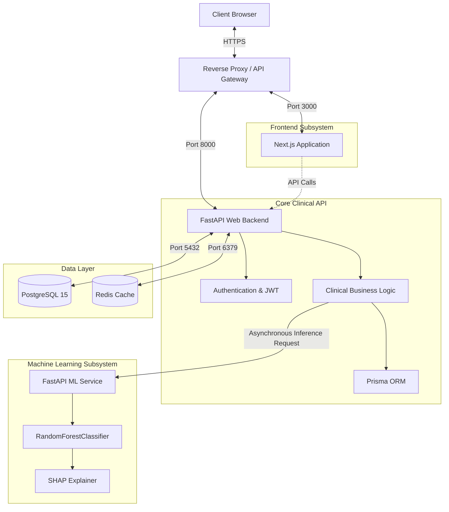

# System Architecture

The Clinical Decision Support System (CDSS) is built on a modern, event-driven microservices architecture designed for high availability, fault tolerance, and clear separation of concerns.

## 🏢 High-Level Component Interactions

## 🧩 Microservice Breakdown

### 1. Frontend Web Application
**Path:** `/frontend`
**Technology:** Next.js 14, React, Tailwind CSS, Zustand (State Management)

The frontend acts as the primary interface for clinical staff, administrators, and patients. It is responsible for:
- Role-based routing (Admin panels vs Clinic panels).
- Managing global authentication state (via Zustand).
- Dynamic rendering of complex clinical forms (e.g., scoring assessments).

### 2. Core Web Backend
**Path:** `/web_backend`
**Technology:** Python 3.10+, FastAPI, Prisma ORM, PyJWT, SlowAPI

The core backend enforces all business logic and is the sole mutator of the PostgreSQL database.
- **Why FastAPI?** Its native support for asynchronous I/O allows the server to efficiently handle hundreds of concurrent clinical requests without blocking thread pools. Pydantic ensures strict type-checking on all incoming JSON payloads, which is critical for medical data.
- **Why Prisma?** While traditionally a Node.js ORM, `prisma-client-py` brings type-safe database queries to Python, drastically reducing the chances of runtime SQL errors.

### 3. Machine Learning (XAI) Service
**Path:** `/ml_service`
**Technology:** Python, FastAPI, Scikit-Learn, SHAP, Joblib

The ML service is intentionally decoupled from the core backend.
- **Reasoning:** Machine Learning inference—especially SHAP value calculation—is CPU-bound. If it ran in the same process as the Web Backend, heavy concurrent traffic would cause the event loop to block, leading to catastrophic timeouts for standard clinical API calls.
- By isolating it, we can independently scale the ML service horizontally using Kubernetes or Docker Swarm if inference load increases.

### 4. PostgreSQL Database
**Technology:** PostgreSQL 15 (Alpine Docker Image)
- The single source of truth for all structured clinical data, tenant configurations, and user credentials.
- All relationships enforce cascading soft-deletes (`isDeleted = true`) rather than hard deletes to satisfy compliance and data-retention laws.

### 5. Redis Cache
**Technology:** Redis 7 (Alpine Docker Image)
- Primarily used by `fastapi-cache2` and `slowapi` to enforce strict rate-limiting on authentication endpoints (preventing brute-force attacks).
- Acts as the storage mechanism for revoked JWT tokens (Blocklist).

## 🛡 Network Boundaries and Trust
- The **Frontend** does not have direct access to the database or the ML service. It MUST route all traffic through the Web Backend API.
- The **ML Service** has no database access. It is completely stateless. The Web Backend must provide all the necessary contextual data (normalized scores, age, demographics) within the inference HTTP request payload. This enforces strict data sanitization before ML consumption.
