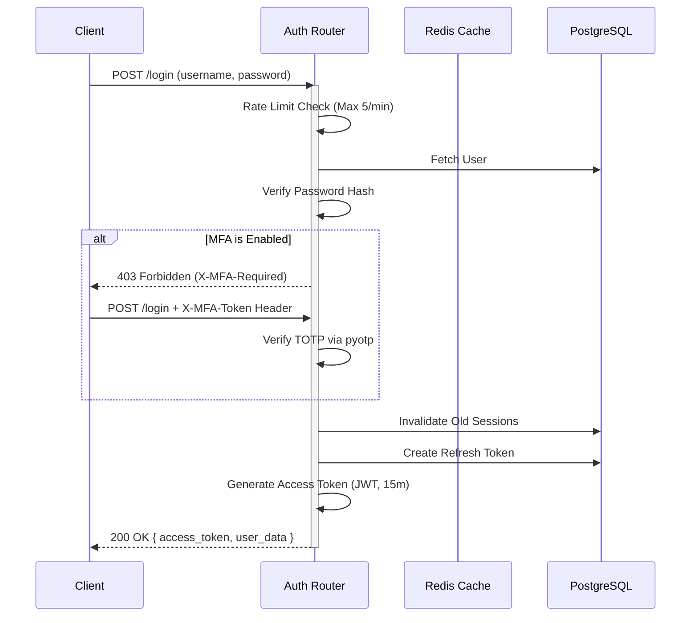

# Authentication & Security Framework

The CDSS platform enforces a zero-trust model utilizing stateless JWTs paired with stateful Refresh Tokens and Redis-backed session invalidation.

## 🔐 Authentication Flow Overview

## 🛡 Security Mechanisms

### 1. JSON Web Tokens (JWT) & State Management
- **Access Tokens:** Short-lived (15 minutes). Sent via the `Authorization: Bearer <token>` header. They contain the user's `id`, `tenantId`, and `role`.
- **Refresh Tokens:** Long-lived (7 days). Stored securely in the `UserSession` PostgreSQL table. When an Access Token expires, the frontend silently calls `/api/v1/auth/refresh` with the Refresh Token to get a new Access Token.
- **Why this approach?** Stateless JWTs are fast and don't require database lookups on every request. However, standard JWTs cannot be revoked. By pairing them with stateful Refresh Tokens, we get the performance of stateless auth with the security of stateful sessions.

### 2. Session Revocation (Redis Blocklist)
If a Super Admin detects a compromised account, or if a user changes their password, we must immediately invalidate their *active* 15-minute JWT.
- **Mechanism:** The backend uses `fastapi-cache2` paired with Redis. When a session is killed, the user's active JWT signature is written to Redis with a TTL matching its remaining expiration time.
- Every authenticated API call first checks the Redis Blocklist. If the token is found, the request is rejected with a `401 Unauthorized`.

### 3. Multi-Factor Authentication (MFA)
- Implemented using the industry-standard Time-based One-Time Password (TOTP) algorithm (`pyotp`).
- **Setup:** A user clicks "Enable MFA". The backend generates a secure base32 secret, saves it to the user's profile, and returns a Base64-encoded QR Code (`qrcode` library) which the user scans with Google Authenticator or Authy.
- **Verification:** During login, if `mfaEnabled` is true, the server returns an explicit `403 X-MFA-Required`. The frontend prompts for the 6-digit pin. The second login attempt includes the `X-MFA-Token` header, which the backend verifies before issuing the JWT.

### 4. Rate Limiting (Brute Force Protection)
- Endpoints like `/api/v1/auth/login` and `/api/v1/auth/refresh` are wrapped with `slowapi` rate limiters.
- **Limit:** 5 requests per minute per IP address.
- Exceeding this limit returns a `429 Too Many Requests` error, drastically mitigating dictionary attacks and brute-force password guessing.

### 5. Password Policies
- Passwords are never stored in plaintext. They are hashed using `bcrypt`.
- A strict regex policy is enforced on all password creation and update endpoints:
  - Minimum 8 characters
  - At least one uppercase letter
  - At least one lowercase letter
  - At least one number
  - At least one special character

## 🚨 Troubleshooting Authentication Issues
- **ModuleNotFoundError: No module named 'fastapi_cache'**: This occurs if the Docker container's Python environment wasn't rebuilt after adding the cache dependency. Run `docker-compose build --no-cache web-backend` to fix.
- **Redis Connection Error:** If the blocklist is failing, ensure the Redis container is running and accessible from the Web Backend on port 6379.
