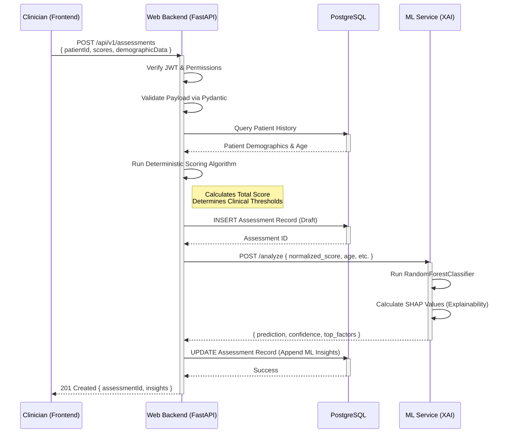
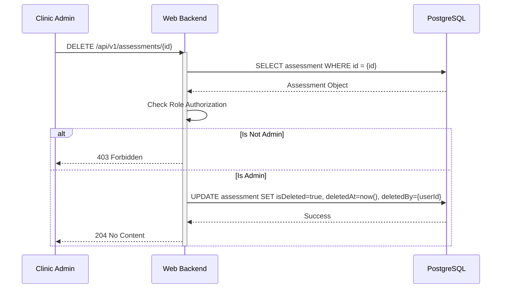

# System Data Flow

This document outlines the critical data paths and execution flows within the Clinical Decision Support System.

## 📥 Core Execution: Clinical Assessment Submission

This is the primary flow of the application. It details what happens when a clinician submits a neurodevelopmental assessment (e.g., CARS, M-CHAT-R) for a patient.

### Flow Breakdown & Validations:

1. **Submission & Authentication:** The frontend submits the raw item scores. The API gateway immediately verifies the `Authorization` header. If the JWT is expired or found in the Redis Blocklist, it rejects the request with a `401 Unauthorized`.
2. **Payload Validation:** FastAPI routes the payload to a Pydantic model. If a clinician submits a score of `5` for a question that only allows `1-4`, Pydantic throws a `422 Unprocessable Entity` before any clinical logic runs.
3. **Deterministic Scoring:** The backend calculates the final score based on rigid, peer-reviewed clinical rules. **This is the ground truth.**
4. **Machine Learning Inference:** The backend sends the structured data to the ML Service. The ML service does *not* override the deterministic score. Instead, it provides a supplementary "Confidence Bound" and "Risk Trajectory" to aid the clinician.
5. **Persistence:** The final, combined object (Raw Scores + Deterministic Score + ML Insights) is saved to PostgreSQL and returned to the UI.

---

## 🗑 Validation Flow: Soft Deletion (Recycle Bin)

The system is designed to adhere to strict health data retention policies. Hard deletions (SQL `DELETE`) are strictly prohibited for clinical entities.

### Flow Breakdown:
1. When a user requests deletion, the backend intercepts the request and verifies the user holds at least a `CLINICAL_ADMIN` role.
2. Instead of removing the row, the backend updates the `isDeleted` boolean flag and sets the audit trail `deletedBy`.
3. All `GET` queries across the application are wrapped with Prisma filters (e.g., `where: { isDeleted: false }`).
4. Super Admins have access to a special Recycle Bin endpoint that queries `where: { isDeleted: true }`, allowing for one-click restoration.
