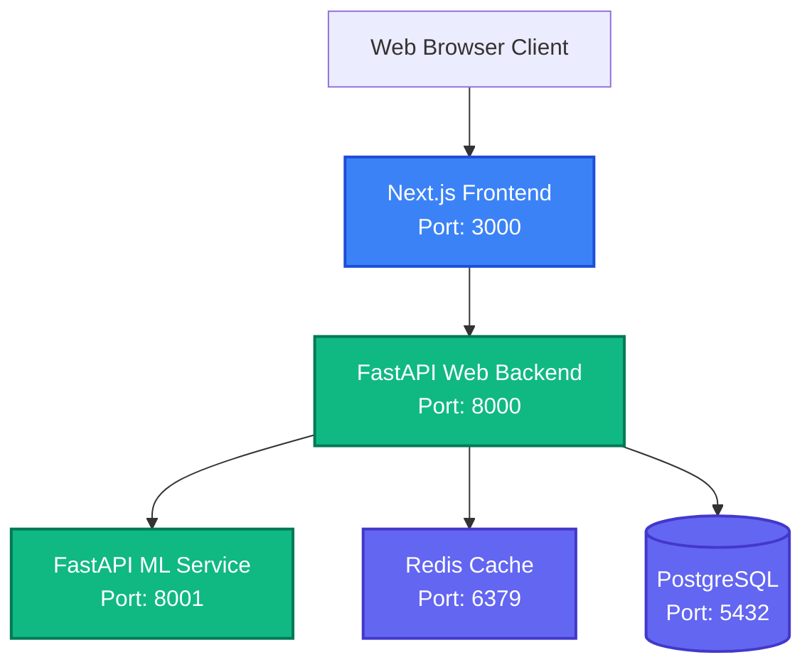

# Enterprise Clinical Assessment Platform (CDSS)

A robust, microservices-based clinical assessment and Electronic Medical Record (EMR) platform designed for administering, scoring, and analyzing neurodevelopmental scales (e.g., CARS, GARS-2, M-CHAT-R). The architecture enforces strict separation of concerns, decoupling deterministic clinical scoring (ground truth) from predictive Machine Learning inference to ensure high availability and data governance.

## 🎯 Business Purpose
The platform serves as a Clinical Decision Support System (CDSS) specifically tailored for neurodevelopmental evaluations. It reduces manual scoring errors, accelerates clinical report generation using standardized templates, and introduces Explainable AI (XAI) to help providers understand complex patient data patterns.

## 🏗 System Architecture & Technology Stack



- **Frontend (Port 3000):** Next.js (App Router), React, Tailwind CSS. Features role-based access control, dynamic age calculation formatting, and explicit scale maximums.
- **Web Backend (Port 8000):** FastAPI (Python). Handles API routing, clinical scoring logic, and database interactions using `prisma-client-py`.
- **ML Service (Port 8001):** FastAPI (Python). A strictly isolated Explainable AI (XAI) service running a Scikit-Learn `RandomForestClassifier`. Calculates probabilistic ML confidence bounds and uses SHAP to calculate driving factor importance.
- **Database (Port 5432):** PostgreSQL, managed via Prisma ORM for Python.
- **Cache (Port 6379):** Redis for API rate limiting, JWT blocklisting, and query caching.
- **Orchestration:** Docker Compose for unified, reproducible deployments.

## 📁 Repository Structure
- `/frontend`: Next.js web application.
- `/web_backend`: Core clinical and administrative APIs.
- `/ml_service`: Isolated machine learning microservice.
- `/config`: Global configuration files (if any).

## 🚀 Quick Start (Local Setup)

The Docker setup is fully automated. When the containers start, a custom `entrypoint.sh` automatically generates the Prisma client, pushes the latest schema to PostgreSQL, and seeds the default clinic and users.

**Prerequisites:** 
- Docker Desktop installed and running.

### 🪟 Windows Users:
Simply double-click or run from command prompt:
```cmd
start.bat
```

### 🍏 Mac / 🐧 Linux Users:
Run the shell script:
```bash
chmod +x start.sh
./start.sh
```

### 🔑 Default Seeded Credentials:
- **Clinical Admin (Doctor):** `doctor@clinic.com` / `Admin@123`
- **Super Admin:** `superadmin@system.com` / `Admin@123`
- **Viewer (Parent):** `parent@portal.com` / `Admin@123`

### 🌐 Access the Applications:
- **Frontend UI:** http://localhost:3000
- **Web Backend API Docs:** http://localhost:8000/docs
- **ML Service API Docs:** http://localhost:8001/docs

**To shut down and wipe the database (factory reset):**
```bash
docker-compose down -v
```

## 🔒 Security & Authentication (Phase B)

The platform implements stringent enterprise security measures:
- **Rate Limiting:** API login endpoints are protected against brute-force attacks via `slowapi` (Max 5 attempts/min) using Redis.
- **Session Revocation:** Secure HTTP sessions utilizing Refresh Tokens alongside short-lived Access Tokens, allowing Super Admins to revoke sessions on compromised devices.
- **Multi-Factor Authentication (MFA):** Supports TOTP-based Multi-Factor Authentication (Google Authenticator) using `pyotp` and `qrcode` backend generators.
- **Password Policies:** Enforces strict regex patterns for all user accounts (min 8 characters, uppercase, lowercase, numbers, and special characters).
- **Data Integrity:** Soft-delete mechanisms enforce `isDeleted` filters globally across repositories, powering a Super Admin Recycle Bin without permanently losing clinical data.

For detailed security information, see [AUTHENTICATION.md](./AUTHENTICATION.md).

## 🔄 Core Data Flow

1. **Authentication:** User logs in via Frontend -> Web Backend validates credentials -> returns JWT.
2. **Clinical Entry:** User submits clinical assessment scores via Frontend -> Web Backend validates raw data and saves to DB.
3. **ML Inference:** Web Backend asynchronously queries the ML Service with normalized data -> ML Service runs inference and SHAP calculations -> Returns confidence bounds back to Web Backend.

For detailed sequence diagrams, see [DATA_FLOW.md](./DATA_FLOW.md).

## 📚 Further Reading
- [System Architecture (ARCHITECTURE.md)](./ARCHITECTURE.md)
- [Authentication & Security (AUTHENTICATION.md)](./AUTHENTICATION.md)
- [Data Flow & Diagrams (DATA_FLOW.md)](./DATA_FLOW.md)
- [Database Schema (DATABASE.md)](./DATABASE.md)
