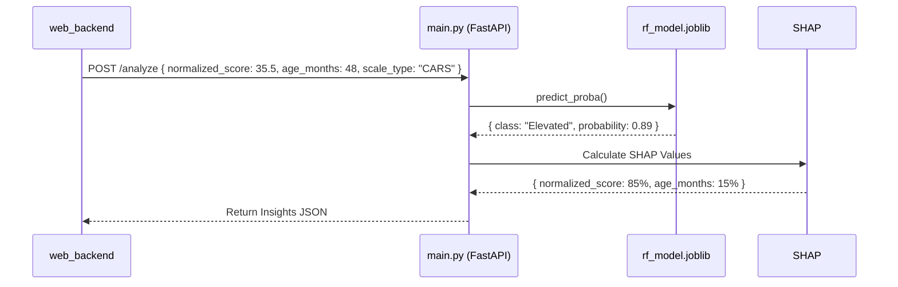

# ML Service (Explainable AI Engine)

## Overview
- **Component Name:** `ml_service`
- **Purpose:** To provide predictive risk analysis and clinical trajectory forecasting based on normalized assessment scores.
- **Responsibilities:** Runs a Scikit-Learn `RandomForestClassifier` on structured clinical data and generates SHAP (SHapley Additive exPlanations) values to make the AI's decision transparent to clinicians.
- **Business Context:** In healthcare, "black box" AI is dangerous and heavily regulated. Clinicians must understand *why* an AI made a specific recommendation. This service implements Explainable AI (XAI) to ensure all predictions are fully interpretable.
- **Why it exists:** Machine Learning inference is CPU-bound. If run inside the core `web_backend`, it would block the async event loop and crash standard API traffic. Isolating it allows for independent scaling.
- **Scope:** Completely stateless. It has no database access. It only receives normalized data, runs a mathematical model, and returns probabilities.

---

## Architecture
- **Position:** An isolated microservice accessible only by the `web_backend` via internal Docker networking (`http://ml-service:8001/analyze`).
- **Dependencies:** FastAPI, Scikit-Learn, Pandas, SHAP.
- **Consumers:** `web_backend/routers/assessments.py`.
- **Internal Relationships:** Uses `rf_model.joblib` trained by `train_model.py`.

---

## File Structure

### `main.py`
- **Purpose:** The FastAPI web server that handles inference requests.
- **Responsibilities:** Loads the model into memory on startup, defines the API schema, and executes the prediction and SHAP calculation pipeline.
- **Exports:** The `app` FastAPI instance.

### `train_model.py`
- **Purpose:** The script used to generate synthetic clinical data and train the initial `RandomForestClassifier`.
- **Responsibilities:** Builds a Scikit-Learn `Pipeline` with `StandardScaler` and `OneHotEncoder`, fits the model to 15,000 synthetic rows, and saves the `.joblib` artifact.

### `rf_model.joblib`
- **Purpose:** The serialized binary of the trained Scikit-Learn model.

---

## Detailed Code Analysis

### `POST /analyze`
- **Purpose:** The core inference endpoint.
- **Inputs:** `InferenceRequest` (Pydantic Model)
  - `scale_type` (str): e.g., "CARS", "M-CHAT-R"
  - `normalized_score` (float): The total score from the assessment.
  - `age_months` (int): Patient age.
- **Outputs:**
  - `risk_level` (str): "High" or "Low"
  - `confidence_score` (float): The probabilistic confidence (0.0 to 1.0)
  - `shap_breakdown` (dict): Feature importance percentages.
  - `trajectory_forecast` (list): A 6-month mocked prediction.
- **Side effects:** None. Purely functional.
- **Error handling:** Includes a mock fallback mechanism if `rf_model.joblib` fails to load or is missing, ensuring the CDSS doesn't completely crash in staging environments without models.

### `generate_trajectory(current_risk: str)`
- **Purpose:** Forecasts the patient's condition over 6 months.
- **Business Logic:** Currently a mock function. In a real-world scenario, this would utilize an LSTM or Hidden Markov Model based on historical patient timelines.

### SHAP Explainer Logic (`shap.TreeExplainer`)
- **Internal Logic:** Extracts the specific `classifier` and `preprocessor` from the Scikit-Learn `Pipeline`. Runs the instance through the `preprocessor`, then uses `shap.TreeExplainer` to calculate exactly how much `normalized_score` and `age_months` mathematically influenced the final `risk_level`. Normalizes these values into percentages for the frontend.

---

## Data Flow

---

## Types and Models

| Model | Type | Description |
|-------|------|-------------|
| `InferenceRequest` | Pydantic BaseModel | The required payload from the web backend. |
| `shap_breakdown` | Dictionary | A mapping of feature names to their percentage influence on the prediction. |

---

## Configuration
- **Port:** Runs on `8001`.
- **Model Path:** Hardcoded to `rf_model.joblib` in the current directory.

---

## Performance Considerations
- **Bottlenecks:** Calculating SHAP values is computationally expensive. For a `RandomForestClassifier`, `TreeExplainer` is highly optimized, but deep trees can still introduce 100-300ms of latency per request.
- **Scalability:** Because this service is completely stateless and loads the model into RAM at startup, it can be scaled to `N` replicas behind a load balancer with zero data inconsistency risks.

---

## Known Limitations
- The current `generate_trajectory` is mocked.
- `train_model.py` generates synthetic data. **DO NOT USE THIS MODEL FOR ACTUAL CLINICAL DIAGNOSIS.** It must be retrained on an IRB-approved, de-identified clinical dataset.
