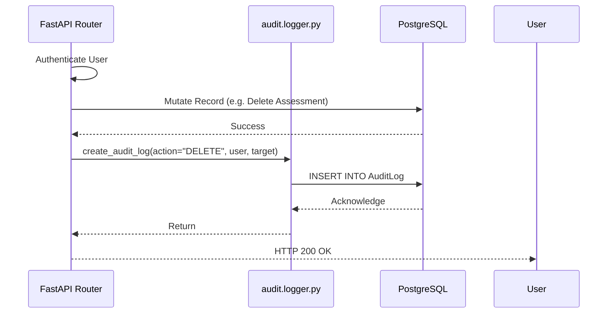

# Web Backend: Audit & Logging Module

## Overview
- **Component Name:** `web_backend/audit`
- **Purpose:** Centralized, immutable event logging for HIPAA compliance.
- **Responsibilities:** Captures discrete user actions ("VIEW_PATIENT", "EDIT_NOTE"), payload diffs, and timestamps, saving them to the `AuditLog` PostgreSQL table.
- **Why it exists:** Clinical software is heavily regulated. Standard `print()` statements or console loggers do not satisfy legal requirements for tracking who accessed a patient's chart and when. This module creates a formalized, structured ledger of all PHI (Protected Health Information) interactions.

---

## File Structure

### `logger.py`
- **Purpose:** Provides the primary Python API for appending records to the audit trail.
- **Exports:** 
  - `async def create_audit_log(...)`
- **Inputs:**
  - `db_client`: An initialized Prisma client instance.
  - `user_id`: The UUID of the authenticated user performing the action.
  - `tenant_id`: The UUID of the clinic.
  - `action`: A string constant (e.g., "DELETE_REPORT").
  - `resource`: The domain entity type (e.g., "Report").
  - `resource_id`: The specific UUID of the record being mutated.
  - `before_state` / `after_state`: Optional JSON dictionaries containing the record's payload before and after the mutation.
  - `ip_address`: Optional origin IP address from the request header.

---

## Data Flow

## Security & Compliance Considerations
- **Immutability:** There are absolutely no `UPDATE` or `DELETE` Prisma queries written against the `AuditLog` table anywhere in the codebase. It is strictly an append-only ledger.
- **Storage:** Storing full JSON diffs (`before_state` and `after_state`) ensures that if a malicious user alters clinical data, the original data is fully preserved in the audit log and can be manually restored by an investigator.
