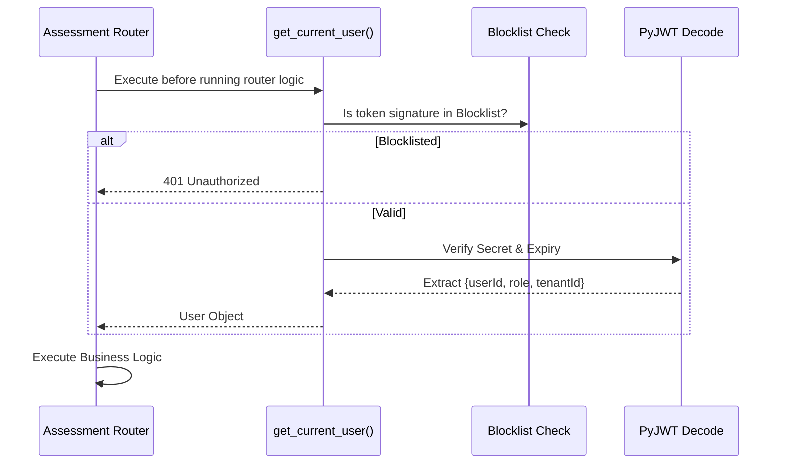

# Web Backend: API Routers

## Overview
- **Component:** `web_backend/routers`
- **Purpose:** Contains all the FastAPI route controllers (endpoints) for the application.
- **Responsibilities:** Request validation, authentication enforcement, business logic execution, database interactions via Prisma, and dispatching tasks to external services (like ML).

---

## Architecture & Communication
All files in this directory are integrated into the main application via `include_router` in `web_backend/main.py`.
- **Dependencies:** `fastapi`, `pydantic` (for DTOs), `prisma` (database client).
- **Middleware Integration:** Routes utilize the `get_current_user` dependency from `web_backend.auth.authorization` to enforce JWT validation and role-based access control.

---

## Detailed Code Analysis

### `auth.py`
- **Purpose:** Core identity and session management.
- **Endpoints:**
  - `POST /login`: Validates credentials, checks MFA requirements, implements Redis blocklisting, and issues JWTs. Rate limited via `@limiter.limit("5/minute")`.
  - `POST /refresh`: Trades a valid `refreshToken` for a new JWT.
  - `POST /logout`: Revokes the current session and adds the JWT to the Redis blocklist.
  - `POST /change-password`: Enforces strict regex validation on new passwords.
- **Security:** Uses `passlib.context` for `bcrypt` hashing.

### `mfa.py`
- **Purpose:** Time-based One Time Password (TOTP) management.
- **Endpoints:**
  - `POST /setup`: Generates a base32 secret using `pyotp` and returns a base64 encoded QR Code via `qrcode`.
  - `POST /verify`: Validates a 6-digit pin to finalize MFA setup.
  - `POST /disable`: Removes MFA requirements from the user account.

### `assessments.py`
- **Purpose:** Clinical scoring and data capture.
- **Business Logic:**
  - `POST /`: Receives raw form data. Before saving to the database, it enforces deterministic scoring (e.g., verifying that a CARS assessment accurately maps responses to clinical totals).
  - **External Call:** Dispatches the total score and patient age to `ML_SERVICE_URL`. Awaits the SHAP values and Confidence Bounds before saving the final `Assessment` record.

### `assessment_templates.py` & `assessment_sessions.py`
- **Purpose:** Powers the dynamic form engine.
- **Business Logic:** Allows administrators to define JSON schemas for new clinical scales (Templates). Clinicians can then launch "Sessions" based on these templates to capture `AssessmentResponse` instances dynamically.

### `reports.py`
- **Purpose:** Formal clinical documentation.
- **Business Logic:** Compiles `AssessmentSessions` into formalized structured documents with `ReportSections`. Supports complex status workflows (`DRAFT` -> `PENDING_REVIEW` -> `APPROVED`). 
- **Data Flow:** When a user clicks "Delete Report", the endpoint intercepts the request and performs a Soft-Delete (`isDeleted=True`) instead of dropping the SQL row.

### `admin.py` & `super_admin.py`
- **Purpose:** Tenant and system management.
- **Endpoints:** `GET /organizations`, `GET /users`, `GET /system/health`.
- **Authorization:** These routers enforce a strict `SUPER_ADMIN` check on the JWT.

### `recycle_bin.py`
- **Purpose:** Data restoration.
- **Endpoints:** `GET /` queries Prisma explicitly for `isDeleted = true`. `POST /{id}/restore` reverses the soft-delete flag, instantly returning clinical data to the primary UI.

---

## Data Flow: Authorization Dependency

Every protected route utilizes FastAPI's `Depends()` injection.

## Maintenance Guide
- **Adding a new endpoint:** Create a new FastAPI `@router.post()` definition. Always use `Depends(get_current_user)` to secure it unless it explicitly needs to be public.
- **Modifying Scoring Logic:** If a clinical scale's scoring rules change, update the deterministic block inside `assessments.py`. DO NOT modify the ML service for deterministic changes.
